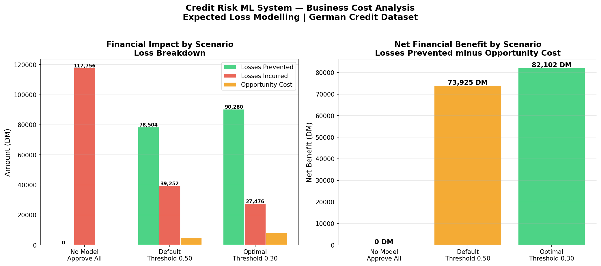
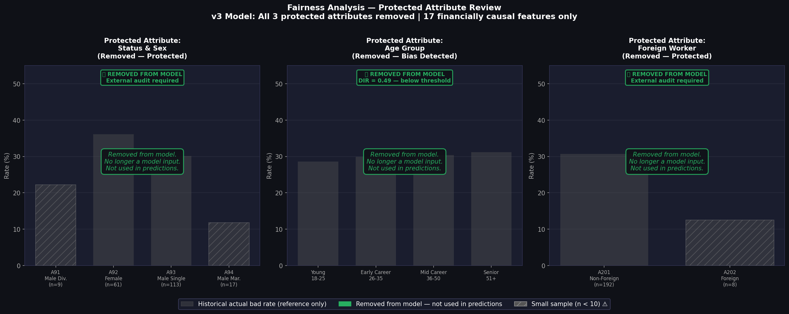
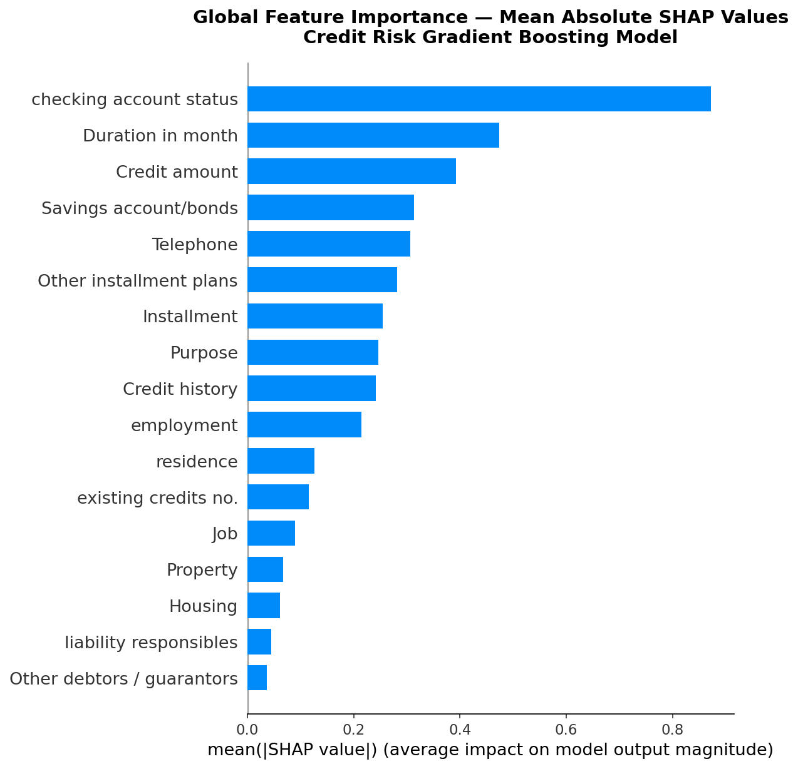

# Credit Risk ML System

A production-grade machine learning system for credit risk 
assessment built on the German Credit Dataset.

**Built by:** Aluka Precious Oluchukwu — Machine Learning Engineer  
**Live Demo:** https://aluka-credit-risk-ml-system-production-2036.up.railway.app  
**GitHub:** https://github.com/Aluka-Analysis/credit-risk-ml-system

---

## Project Overview

This system assesses credit risk for loan applicants using an 
explainable Gradient Boosting model. A bank officer submits a 
loan application through a professional web interface and 
receives an instant decision with plain English explanation.

---

## Live Demo

Visit the live system:  
https://aluka-credit-risk-ml-system-production-2036.up.railway.app

---

## System Architecture
Raw Input from Bank Officer

↓
Professional Web Interface (HTML/CSS/JS)

↓

FastAPI Inference Service
↓

StandardScaler → Feature Scaling

↓

Gradient Boosting Classifier

↓

SHAP Explainer → Feature Contributions

↓

Decision + Probability + Reasons

↓

Bank Officer sees result instantly
---

## Phases Completed

- ✅ Phase 1 — Project Setup and Architecture
- ✅ Phase 2 — Exploratory Data Analysis
- ✅ Phase 3 — Feature Engineering
- ✅ Phase 4 — Model Training and Evaluation
- ✅ Phase 5 — SHAP Explainability and Fairness Analysis
- ✅ Phase 6 — FastAPI Inference Service and Frontend
- ✅ Phase 7 — Docker Containerisation and Railway Deployment
- ✅ Phase 8 — Model Card and Documentation

---

## Model Performance

| Metric | Value |
|--------|-------|
| Algorithm | Gradient Boosting Classifier |
| AUC-ROC | 0.7869 |
| Recall | 0.6667 |
| Precision | 0.5479 |
| F1 Score | 0.6015 |
| Optimal Threshold | 0.30 |
| Training Data | German Credit Dataset — 1000 applicants |
| Features Used | 17 — protected attributes removed |

---

## Fairness and Responsible AI

Three protected attributes were removed from the model:

| Attribute | Reason |
|-----------|--------|
| Status and Sex | Disparate Impact Ratio 0.28 — failed 0.80 threshold |
| Foreign Worker | Legally protected nationality attribute |
| Age in Years | Proxy discrimination detected after sex removal |

Removing protected attributes caused zero performance loss 
and increased financial savings by 10,303 DM — proving 
fairness and profitability are not in conflict.

---

## API Endpoints

| Endpoint | Method | Description |
|----------|--------|-------------|
| / | GET | Bank officer frontend interface |
| /predict | POST | Credit risk assessment |
| /health | GET | System health check |
| /model-info | GET | Model details and metrics |
| /docs | GET | Swagger UI documentation |

---

## Tech Stack

| Category | Tools |
|----------|-------|
| Language | Python 3.11 |
| ML | Scikit-learn, Imbalanced-learn |
| Explainability | SHAP |
| API | FastAPI, Uvicorn |
| Frontend | HTML, CSS, JavaScript, Chart.js |
| Deployment | Docker, Railway |
| Version Control | Git, GitHub |

---

## Key Visualisations

### Business Cost Analysis

### Fairness Analysis

### SHAP Global Feature Importance

---

## Project Structure

credit-risk-ml-system/

├── notebooks/

│   ├── 01_eda.ipynb

│   ├── 02_feature_engineering.ipynb

│   ├── 03_model_training_v2.ipynb

│   └── 04_shap_explainability.ipynb

├── src/

│   └── api/

│       ├── main.py

│       ├── predict.py

│       ├── schemas.py

│       └── adverse_action.py

├── models/

│   ├── credit_risk_production_model.pkl

│   ├── optimal_threshold.pkl

│   └── scaler.pkl

├── frontend/

│   └── index.html

├── data/

│   ├── raw/

│   └── processed/

├── Dockerfile

├── docker-compose.yml

└── requirements.txt
---

## Author

**Aluka Precious Oluchukwu**  
Machine Learning Engineer    

LinkedIn: https://www.linkedin.com/in/aluka-precious-b222a2356 

GitHub: https://github.com/Aluka-Analysis
